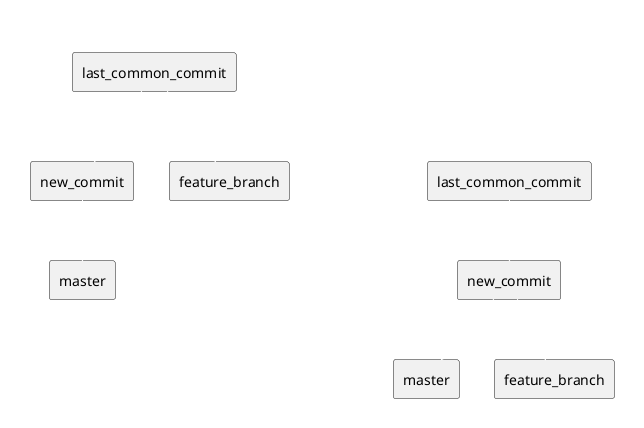

+++
title = "A general guide to git rebase"
date = 2024-09-20
[taxonomies]
tags= ["git", "rebase", "guide"]
+++

In general, I want to point out that:

- Rebasing is a powerful tool.
- The more atomic the commits are, the easier the rebase will be.
- If you encounter a complicated merge conflict, you **will abort**.
- Interactive rebases are your friend.

## The Basics

### What is a rebase?

A rebase is a way to move a branch to a new base commit. This is useful for cleaning up your commit history and for making sure that your branch is up-to-date with the latest changes in the master branch.

<center>



</center>

### Basic Commands for Rebasing

- `git rebase <branch>`: Rebase onto the latest commit in the branch.
- `git rebase -i <branch>`: Interactive rebase onto the latest commit in the branch.
- `git rebase -i <commit>`: Interactive rebase onto a specific commit.
- `git rebase -i HEAD~<n>`: Interactive rebase onto the last `n` commits.
- `git rebase --abort`: Abort the rebase. Use this out of reflex if you encounter a merge conflict. Rethink your strategy and try again.
- `git rebase --continue`: Continue the rebase after resolving a merge conflict.

### Simple Rebase onto Master (or another branch)

This is the most common rebase scenario. You have a feature branch that you want to rebase onto the latest changes in the master branch.

```bash
git fetch # Make sure you have the latest changes
git rebase origin/master # Rebase onto the latest changes in master
```

Our way of working usually forbids this, but it's possible to rebase onto another branch.

```bash
git fetch # Make sure you have the latest changes
git rebase origin/other-branch # Rebase onto the latest changes in other-branch
```

### Interactive Rebase

Interactive rebases are useful for squashing commits, reordering commits, and editing commit messages. This is what makes rebasing so powerful.

In Monogau, we have the brilliant `m git polish` command that does the heavy lifting for you.
It identifies the last common commit between your branch and the master branch, and then rebases your branch onto the master branch.

You will be presented with a list of commits that you can `edit`. You can squash commits by changing `pick` to `squash` or `s`. You can reorder commits by moving the lines around. You can edit commit messages by changing the text after the commit hash.

```git-rebase-todo
pick 07cc8d1c9 fix(lambda): enable versioning for all environments
pick 17a12a98b refactor(ci): move functions into scripts (bin/ci_before, bin/*_utils)
pick 7ffd10713 add(env): enable unified secrets everywhere
pick c4a491888 add(ci): frontend docker image build job
pick acb59bddb chore(repo): sort package.json for refactoring
pick 710c0ea90 add(repo): m build:lambdas command
pick 7016ee161 chore(repo): upgrade axios, oauth-pkce
pick 9bcaad269 add(@dpl/harbinger): the pipeline debugger
```

You can enhance the interactive rebase by installing various VSCode extensions.
After you save and close the file, the rebase will begin.

#### Time Traveling with Rebase

Ever wished you had a time machine to go back and fix a commit? Well, with rebase, you can!

If you encounter a fix to one of your previous commits, you can edit the commit by amending it.
Stash your changes, rebase interactively, and mark the commit for editing.
Then, unstash your changes and amend the commit.

#### Splitting Commits

- If you have a commit that does multiple things, you **must** split it into multiple commits.
- Often, commits contain unrelated changes, and it's better to split them into separate commits.
- This makes moving commits around and squashing them with related commits easier.
- If your branch is a mess, squash it first and then split it up again.
- Make use of staging selected ranges to atomize your commits even more.

1. Inspect the commit on your branch to identify splittable commits.
2. Mark the commit for editing in the interactive rebase.
3. When the rebase stops at the commit, use `git reset --soft HEAD~1` to uncommit the changes.
4. Select the changes you want to commit and stage them.
5. Commit the changes.
6. Repeat until all changesets are committed.

#### The Process

There is no flowchart for this, but the process is simple:

- Pull together all the changes that are related to one (sequence of) commit(s).
- Split off side-effects into separate commits.
- Order those change sequences by dependencies.
- **Reword commits to include the appropriate ticket number.**

#### I broke my branch!

If your branch is broken after a rebase, you can always reset it to the previous states.
Your frined is the good old `git reflog` and checking out previous refs.

```bash
git checkout DW-1234@{1} # Go back to the state before the rebase
git checkout DW-1234@{2} # Go back to the state before the rebase before that
```
